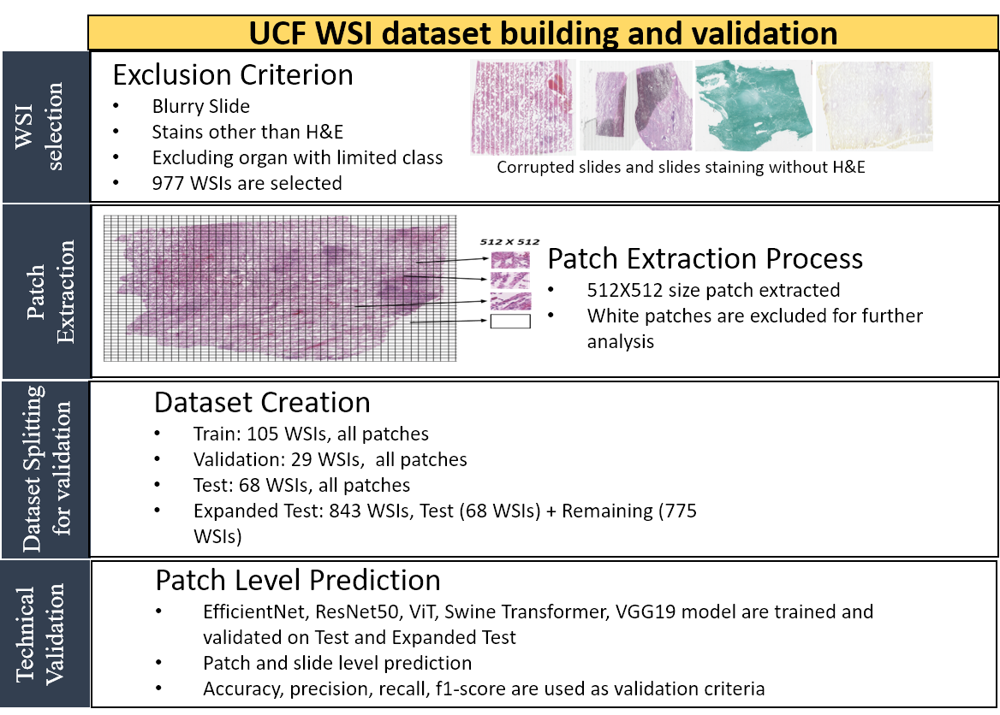

# **P4:** Whole Slide Image (WSI) Cadaver Tissue Patch Preparation and Classification
## Summary
In this project, we introduce a challenging dataset, which contains 15 organ classes for deep learning model development and validation. Our publicly available dataset addresses a crucial gap in digital pathology by providing a large, diverse, and annotated collection of whole slide histopathology images, following FAIR principles. It serves as a benchmark for medical imaging analysis tasks like disease classification, and cancer and pneumonia cell segmentation, enabling improved diagnostics and treatment strategies. With its diverse organ classes and a vast number of patches, it is an ideal resource for transfer learning, accelerating research progress. Crucially, by introducing substantial publicly available data into this field, the dataset overcomes a fundamental challenge, paving the way for more robust deep-learning models in digital pathology. Overall approach of our work is provided in the following Figure:

  

## Dataset
Our dataset is available on the following [link](https://stars.library.ucf.edu/ucfnecropsywsi/). The dataset contains 15 organ classes. A sample WSI image of each Organ class is provided in the following Figure.

 
# **P3:** Smartphone-Video Based Human Kinetics Estimation

## Summary

  

This repository contains the code and models developed for estimating joint moments and 3D ground reaction forces (GRFs) using smartphone video data. Our approach offers a **cost-effective** and **accessible alternative** to traditional methods that require expensive equipment like force plates and motion capture systems. By utilizing only 2-D joint center data obtained from smartphone videos, our novel deep learning model effectively estimates joint moments and GRFs without the need for inertial measurement units (IMUs).
To address the limitations of video-only data, we employ a **knowledge transfer and distillation process** from a teacher model that integrates IMU and video data, enhancing the performance of the video-only student model. Additionally, we incorporate 2-D joint center velocity and acceleration into a **multi-modal fusion framework** to further improve estimation accuracy.

Our results demonstrate a significant reduction in **normalized root mean square error (NRMSE)** and an increase in **Pearson correlation coefficient (PCC)**, underscoring the effectiveness of the proposed method. The models achieve:

- **Student Model (Video-Only):** 
  - NRMSE reduced from **5.71** to **4.68**
  - PCC increased from **0.929** to **0.951**
  
- **Teacher Model (IMUs + Video):**
  - NRMSE reduced from **4.38** to **3.63**
  - PCC increased from **0.961** to **0.971**

Explore the code and models to implement this advanced, accessible solution for biomechanical analysis using just smartphone videos.

## Model Overview
Our proposed approach of knowledge distillation with a teacher and student model. Initially, a teacher model is trained, followed by pre-training the student model's encoder using Knowledge Distillation (KD) loss, leveraging the trained teacher model's encoder. Subsequently, a pre-trained student encoder is coupled with MFM and then fine-tuned to obtain the student model.

  

# **P2:** Sparse IMU Sensor-Based Joint Angles, Joint Moments, and GRFs Estimation

## Overview
This project introduces **Kinetics-MFFM-Net**, a lightweight model designed to estimate gait kinetic parameters (such as joint moments and ground reaction forces) using sparse inertial measurement unit (IMU) sensors. The model aims to overcome the limitations of traditional optical motion capture systems and full-body IMU sensor setups, which can be expensive, cumbersome, and impractical for daily use.

## Key Contributions
- **Sparse IMU Setup**: Instead of using a large number of IMU sensors, this study explores the use of a reduced number of IMUs, allowing for more practical and flexible sensor placement.
- **Kinetics-MFFM-Net**: A lightweight deep learning model that employs a multi-modal fusion technique with two encoders and a gating mechanism to estimate gait kinetics.
- **Sensor Distillation**: A novel approach based on knowledge distillation. A **teacher model** (Kinetics-MFFM-Net(T)) is trained using a full set of IMU sensors and other sensor types, while a **student model** (Kinetics-MFFM-Net(S)) is trained using sparse IMUs, significantly improving the performance of sparse sensor setups.
  
## Results
- **Improved Performance**: The sensor distillation technique enhances estimation performance on two datasets with different sparse sensor combinations.
- **Efficiency**: Both the teacher and student models demonstrate computational efficiency and achieve statistically significant improvements compared to state-of-the-art models.
- **Real-Time Deployment**: The models are lightweight and suitable for real-time deployment, making them ideal for practical applications.
- 
## Conclusion
The proposed **Kinetics-MFFM-Net** and its sensor distillation approach provide a practical and efficient solution for gait kinetics estimation using sparse IMU sensors, outperforming current methods in both accuracy and computational efficiency.

# **P1:** Prediction and Reconstruction of 3D Human Pose Using IMUs and Wearable Cameras

## Summary

Reconstructing and predicting 3D human walking poses in unconstrained environments has significant potential for use in health monitoring systems, especially for individuals with movement disabilities. By assessing progression after treatments and providing data for assistive device controls, these systems can aid patient care. Current pose estimation algorithms rely on motion capture systems that gather data from IMU sensors and third-person cameras. However, third-person views are often impractical for outpatients.

  

This paper proposes a wearable motion capture approach that reconstructs and predicts 3D human poses using only wearable IMU sensors and wearable cameras, enabling clinicians to monitor patients remotely. The key contribution is a novel **Attention-Oriented Recurrent Neural Network (AttRNet)**, which includes:
- A sensor-wise attention-oriented recurrent encoder
- A reconstruction module
- A dynamic temporal attention-oriented recurrent decoder

This network reconstructs 3D human poses over time and predicts future poses at subsequent time steps. To validate the approach, a new [**WearableMotionCapture**](https://drive.google.com/drive/folders/1JDQhw0I27_1TrkeqN7NUDGxrcIO3tT18?usp=sharing) dataset was created, combining IMU and camera data with musculoskeletal joint angle ground truth. The proposed AttRNet achieves high accuracy on the lower-limb WearableMotionCapture dataset and outperforms state-of-the-art methods on two public datasets: **DIP-IMU** and **TotalCapture**.

## Dataset

[WearableMotionCapture](https://drive.google.com/drive/folders/1JDQhw0I27_1TrkeqN7NUDGxrcIO3tT18?usp=sharing)

# Demo Videos

Walking on Treadmill

Walking on Stair

Walking on Slope

Walking on Ground and Avoiding Obstacles

